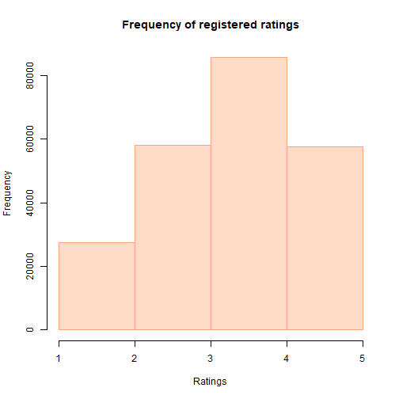
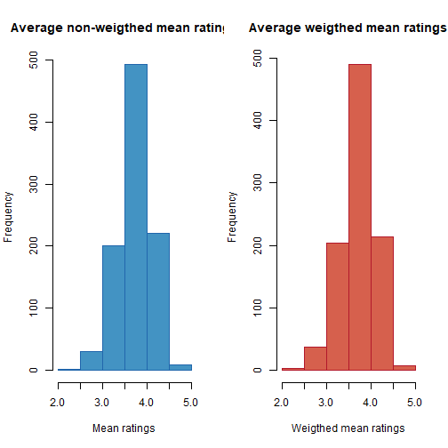
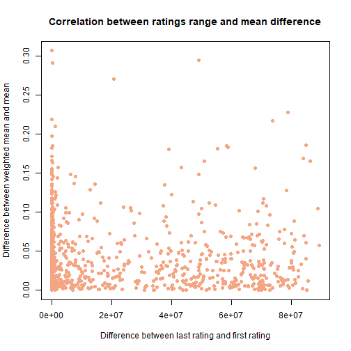
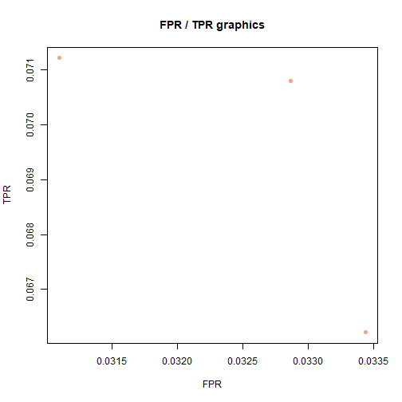

# Sistemi di raccomandazione in R

### Introduzione

I **sistemi di raccomandazione** sono dei sistemi software che permettono di predire le preferenze di un utente basandoci sui dati raccolti in passato.  
A differenza dei sistemi tradizionali, essi possono predire il gradimento dell'utente anche per oggetti meno popolari, catturando il cosiddetto fenomeno **long-tail**.  
Un sistema di raccomandazione è strutturato in una matrice chiamata **matrice di utilità**, avente:  
- nelle righe, gli utenti del sistema.  
- nelle colonne, gli oggetti da valutare.  
- nelle celle, la valutazione dell'oggetto della colonna `j-esima` relativa all'utente della riga `i-esima`.  

I sistemi di raccomandazione possono dividersi in due categorie.  
La prima categoria contiene i sistemi di raccomandazione **content-based** che utilizzano le informazioni sulle proprietà degli item per generare un profilo di ogni item. Inoltre, mantengono un profilo dell'utente che riflette le sue preferenze in base alle proprietà degli item che ha già valutato in passato. Per suggerire nuovi item all'utente, il sistema calcola la similarità tra il profilo dell'utente e quello degli item presenti ancora da valutare, e suggerisce gli item che presentano la maggiore somiglianza. Le predizioni sugli item vengono quindi effettuate sulla base della corrispondenza tra le proprietà degli item suggeriti e il profilo dell'utente.  
La seconda categoria contiene i sistemi **collaborative-filtering** che utilizzano le informazioni sulle interazioni passate degli utenti con gli item per generare raccomandazioni personalizzate. In particolare, questi sistemi possono essere basati sulla similarità tra gli utenti (user-based collaborative filtering) o tra gli item (item-based collaborative filtering).  
Nel caso dell'user-based collaborative filtering, le predizioni sugli item per un utente vengono fatte basandosi sull'esperienza degli altri utenti simili a lui. Questo viene fatto calcolando la similarità tra il profilo di gradimento dell'utente corrente e quello degli altri utenti, e utilizzando queste informazioni per generare una lista di raccomandazioni personalizzate.  
Nel caso dell'item-based collaborative filtering, invece, le predizioni sugli item vengono fatte basandosi sulla similarità tra gli item presenti nel catalogo. Il sistema cerca gli item che sono stati graditi da utenti simili a quello corrente, e utilizza queste informazioni per generare una lista di raccomandazioni personalizzate.  
In entrambi i casi, i sistemi di raccomandazione collaborative filtering sfruttano la conoscenza delle preferenze degli utenti per generare raccomandazioni personalizzate, senza la necessità di conoscere dettagliate informazioni sulle proprietà degli item.

### Obiettivo
Creeremo diversi sistemi di raccomandazione e ne confronteremo le prestazioni. Useremo anche diverse varianti fra cui alcune che normalizzano i rating degli item secondo una media pesata ed altre varianti che usano rating binari, dove i valori assegnati ai rating sono semplicemente `0/1`.  
Useremo il dataset [MovieLens](https://grouplens.org/datasets/movielens/1m/) per generare i sistemi. Al suo interno sono presenti tre tabelle `.csv`:  
- `movies.csv`: contiene l'elenco dei film, con i campi `movieId`, `title` e `genres`.  
- `ratings.csv`: contiene l'elenco delle valutazione relative agli utenti, con i campi `userId`, `movieId`, `rating`, `timestamp`.  
- `users.csv`: contiene l'elenco degli utenti e le loro informazioni, con i campi `userId`, `gender`, `age`, `occupation`, `zip`.  

### Preparazione dell'ambiente
All'interno del nostro progetto, useremo diverse librerie:  
- [`reshape2`](https://cran.r-project.org/web/packages/reshape2/index.html), permette di creare data frame oppure matrici partendo da una lista.  
- [`reccomenderlab`](https://cran.r-project.org/web/packages/recommenderlab/index.html), permette la creazione e la valutazione dei sistemi di raccomandazione.  
- [`sqldf`](https://cran.r-project.org/web/packages/sqldf/index.html), permette la manipolazione di data frame usando la sintassi SQL.  

Importiamo i pacchetti all'interno del progetto:

```r
library("reshape2")
library("recommenderlab")
library("sqldf")
```

Carichiamo i dataset all'interno del progetto usando la funzione `read.csv`:

```r
movie_dataset <- read.csv("movie-dataset/movies.csv",  sep = "+")
rating_dataset <- read.csv("movie-dataset/ratings.csv", sep = "+")
```

### Pulizia dei dati

Una volta caricati i dati, verifichiamone l'**integrità**.  
L'integrità dei dati è essenziale per garantire l'affidabilità dei risultati dell'analisi.  
La presenza di dati incompleti, come i valori `NA`, potrebbero influenzare negativamente i risultati.  
All'interno di R, è presente la funzione `complete.cases` che restituisce una struttura dati popolata da valori booleani con:  
- `TRUE`, nel caso in cui i dati sono popolati.  
- `FALSE`, nel caso in cui i dati non sono popolati.  
Questa funzione può essere usata per effettuare una **pulizia** sul data frame:

```r
movie_dataset <- movie_dataset[complete.cases(movie_dataset), ]
rating_dataset <- rating_dataset[complete.cases(rating_dataset), ]
```

Scartati i dati nulli o incompleti, prendiamo in considerazione solo una porzione dei dati, in particolare consideriamo solo:  
- gli utenti che hanno valutato **almeno 300 film**.  
- i film che sono stati valutati **almeno 600 volte**.  
Questo condizione ci permette di escludere utenti e film che non sono stati valutati abbastanza e per cui **non sono presenti abbastanza dati per poter effettuare predizioni sufficientemente accurate**.  
Filtriamo quindi il data frame delle valutazione in base alle condizione sopra citate:  

```r
grouped_users <- sqldf("SELECT userId, COUNT(movieId) as count_user FROM rating_dataset GROUP BY userId")
grouped_movies <- sqldf("SELECT movieId, COUNT(userId) as count_movie FROM rating_dataset GROUP BY movieId")
rating_dataset <- sqldf(
  "SELECT rating_dataset.userId, rating_dataset.movieId, rating, timestamp, count_user, count_movie FROM rating_dataset 
   LEFT JOIN grouped_users ON grouped_users.userId = rating_dataset.userId
   LEFT JOIN grouped_movies ON grouped_movies.movieId = rating_dataset.movieId
   WHERE count_user > 300 AND count_movie > 600
  "
)
```

### Analisi dei dati

Dopo un primo filtro, possiamo caricare i dati relativi agli utenti:

```r
users_dataset <- read.csv('movie-dataset/users.csv', sep = '+')
```

Da questi, leviamo gli utenti che non sono più inclusi nelle valutazioni:

```r
users_dataset <- sqldf("
  SELECT userId, gender, age, occupation, zip FROM users_dataset
  WHERE userId IN (SELECT DISTINCT(userId) FROM rating_dataset)
")
```

Una volta rimossi dal data frame gli utenti che non hanno fatto recensito abbastanza film, aggiungiamo le seguenti colonne:  
- `mean`, contiene la media delle valutazione lasciate dall'utente.  
- `weighted_mean`, contiene la media pesata usando i timestamp delle valutazioni lasciate dall'utente.  
- `ratings_range`, contiene la differenza fra la prima valutazione e l'ultima valutazione lasciata dall'utente.  
- `mean_diff`, contiene la differenza fra la media aritmetica e la media pesata delle valutazioni.  

Gli ultimi due campi ci permetteranno di dimostrare se esiste una correlazione tra:  
- la differenze fra le media aritmetica e la media pesata.  
- l'arco temporale fra la prima e l'ultima valutazione.  
In pratica, vogliamo verificare se in un intervallo temporale più ampio, la differenza fra la media aritmetica e quella pesata aumenta.  
Creiamo quindi le colonne ed aggiungiamole al data frame:

```r
users_dataset['mean'] <- replicate(nrow(users_dataset), 0)
users_dataset['weigthed_mean'] <- replicate(nrow(users_dataset), 0)
users_dataset['ratings_range'] <- replicate(nrow(users_dataset), 0)
users_dataset['mean_diff'] <- replicate(nrow(users_dataset), 0)
```

Una volta aggiunti i campi, effettuiamo tutti i calcoli necessari per popolare i campi.  
Per calcolare la media pesata, abbiamo bisogno di una funzione che mappi i timestamp in un intervallo più piccolo di quello esistente. La funzione `map_range`, dato un minimo ed un massimo, converte i valori nell'intervallo assegnandogli un valore fra `0.5` e `1.5`. Questo ci permette di assegnare un peso nullo, ovvero `1`, alle valutazione fatte a *"metà"* nell'arco temporale. Creiamo quindi la funzione:

```r
map_range <- function(x, min_val, max_val, new_min = 0.5, new_max = 1.5) {
  y <- (x - min_val) * (new_max - new_min) / (max_val - min_val) + new_min
  return(y)
}
```

Effettuiamo dunque i calcoli effettivi, assegnando i valori `mean`, `weigthed_mean`, `ratings_range` e `mean_diff`:

```r
for (user_index in 1:nrow(users_dataset)) {
  user <- users_dataset[user_index, 'userId']
  single_user_dataset <- rating_dataset[rating_dataset[, 'userId'] == user, ]
  single_user_first_rating <- min(single_user_dataset[, 'timestamp'])
  single_user_last_rating <- max(single_user_dataset[, 'timestamp'])
  single_user_ratings <- single_user_dataset[, 'rating']
  single_user_weigths <- sapply(
    single_user_dataset[, 'timestamp'], 
    function (x) map_range(x, single_user_first_rating, single_user_last_rating)
  )
  single_user_mean <- mean(single_user_ratings)
  single_user_weight_mean <- weighted.mean(single_user_ratings, single_user_weigths)
  users_dataset[user_index, 'mean'] <- single_user_mean
  users_dataset[user_index, 'weigthed_mean'] <- single_user_weight_mean
  users_dataset[user_index, 'ratings_range'] <- single_user_last_rating - single_user_first_rating
  users_dataset[user_index, 'mean_diff'] <- abs(single_user_weight_mean - single_user_mean)
}
```

Dopo aver effettuato tutti i calcoli, vediamo i risultati.
Il primo grafico che vediamo è relativo alla frequenza delle valutazioni all'interno del data frame.

```r
hist(
  rating_dataset[, 'rating'],
  breaks = 5,
  main = 'Frequency of registered ratings', 
  xlab = 'Ratings', 
  col = '#FDDBC7',
  border = '#F4A582'
)
```



I prossimi due grafici sono relativi alla frequenza della media aritmetica e della media pesata per utente:

```r
par(mfrow = c(1,2))
hist(
  users_dataset[, 'mean'],
  breaks = 5,
  main = 'Average non-weigthed mean ratings', 
  xlab = 'Mean ratings',
  col = '#4393C3',
  border = '#2166AC'
)
hist(
  users_dataset[, 'weigthed_mean'],
  breaks = 5,
  main = 'Average weigthed mean ratings', 
  xlab = 'Weigthed mean ratings',
  col = '#D6604D',
  border = '#B2182B'
)
```


Osservando i due grafici, notiamo che i valori assegnati alla media pesata sono tendenzialmente più bassi.  
Il terzo grafico ci mostra l'andamento fra la differenze fra le media aritmetica ed il range temporale in cui sono state lasciate le valutazione. Verifichiamo quindi se esiste la correlazione sopra citata:

```r
plot(
  x = users_dataset[, 'ratings_range'], 
  y = users_dataset[, 'mean_diff'], 
  pch = 16, 
  xlab = 'Difference between last rating and first rating',
  ylab = 'Difference between weighted mean and mean',
  main = 'Correlation between ratings range and mean difference',
  col = '#F4A582'
)
```


Dal grafico, notiamo che i valori si concentrano principalmente sulla parte bassa del grafico. Ciò significa che non è detto che all'aumentare della variazione della media corrisponda un aumento del range temporale.

### Creazione dei sistemi di raccomandazione

Dopo aver pulito ed analizzato i dati, possiamo procedere alla creazione della matrice di utilità.  
Essendo il nostro dataset organizzato in una lista, è necessario effettuare una conversione.  
Nel pacchetto `reshape2` è inclusa la funzione `acast` che prendendo in input le liste di valori, la formula per creare righe e colonne ed il nome della lista relativa al valore da inserire nelle celle, ci restituisce una matrice.  
Nel nostro caso, `rating_dataset` rappresenta il dataset con tutte le righe, `userId~movieId`rappresenta la formula per ottenere rispettivamente nelle righe gli utenti e nelle colonne i film, il valore `rating` rappresenta il valore nelle celle.  
Utilizziamola nel nostro caso:

```r
converted_matrix <- acast(rating_dataset, userId~movieId, value.var = "rating")
```

Adesso, la possiamo usare come oggetto di tipo `realRatingMatrix`, che reccomenderlab riconosce:

```r
rating_matrix <- as(converted_matrix, "realRatingMatrix")
```

`reccomenderlab` supporta diversi modi per addestrare il sistema di raccomandazione:  
- **Split**, implica la suddivisione del dataset in due parti, una per il training e l'altra per il testing. Generalmente, si divide il dataset in modo che il 70-80% dei dati siano utilizzati per il training e il restante 20-30% per il testing. Questa tecnica è semplice e veloce da implementare, tuttavia, la scelta di come suddividere il dataset in training e testing può influenzare significativamente l'accuratezza del modello.  
- **Bootstrap**, prevede di creare diverse ripetizioni del dataset (sampling con ripetizione) e di selezionare casualmente il training e il test set in ogni ripetizione. In questo modo, ogni osservazione ha la stessa probabilità di essere selezionata per il training set o il test set in ogni ripetizione.   
- **Cross Validation** (validazione incrociata), prevede di suddividere il dataset in k parti uguali, chiamate fold. Il modello viene poi addestrato su k-1 fold e testato sul fold rimanente. Questo processo viene ripetuto k volte, utilizzando un fold differente come test set ad ogni ripetizione. In questo modo, ogni osservazione viene utilizzata sia per il training che per il testing. Questa tecnica può essere utile per valutare il modello in modo più accurato, riducendo l'effetto della scelta casuale dei dati di training e testing.   

Creiamo quindi i diversi schemi di dati che utilizzeremo:

```r
split_matrix <- evaluationScheme(
  data = rating_matrix, 
  method = "split", 
  train = 0.8, 
  given = 240, 
  goodRating = 3
)
```

```r
bootstrap_matrix <- evaluationScheme(
  data = rating_matrix, 
  method = "bootstrap",
  given = 240, 
  goodRating = 3
)
```

```r
k_fold_matrix <- evaluationScheme(
  data = rating_matrix, 
  method = "cross-validation",
  k = 8, 
  given = 240, 
  goodRating = 3
)
```

Dopo aver generato i possibili modi per addestrare il sistema di raccomandazione, creiamo i modelli che addestreremo.  
`reccomenderlab` ci permette di impostare diversi parametri nella creazione di un modello, fra cui:  
- `name`, indica come `reccomenderlab` gestisce il tipo di sistema di raccomandazione.  
- `method`, indica la formula matematica usata per misurare la similarità fra due insiemi di dati.  
- `normalize`, indica la formula matematica usata per normalizzare la matrice di utilità del sistema di raccomandazione.  

Come tipologia di sistemi, quindi come parametro `name`, useremo:  
- **UBCF** (User Based Collaborative Filtering).  
- **IBCF** (Item Based Collaborative Filtering).  

Come formula per valutare la similarità fra due insieme di dati, useremo:  
- **Similarità del coseno** (`cosine`):
$$
\text{cossim}(\mathbf{x}, \mathbf{y}) = \frac{\mathbf{x} \cdot \mathbf{y}}{|\mathbf{x}| |\mathbf{y}|}
$$
- **Correlazione di Pearson** (`person`):
$$
\text{correlation}(X, Y) = \frac{\text{cov}(X, Y)}{\text{std}(X) \cdot \text{std}(Y)}
$$
Entrambe le misure ritornano un valore da -1 ad 1, dove al valore -1 corrisponde una similarità nulla, mentre al valore 1 corrisponde una similarità totale.

Come misure di normalizzazione, quindi come parametro `normalize`, useremo:  
- **Center** (`center`):
$$
r'_{u,i} = r_{u,i} - \mu_u
$$
- **Z-Score** (`z-score`):
$$
r'_{u,i} = \frac{r_{u,i} - \mu_u}{\sigma_u}
$$
La principale differenza sta nel calcolo: mentre la normalizzazione `center` calcola semplicemente la media delle valutazione e le sottrae al rating dell'oggetto $i$ relativo all'utente $u$, la normalizzazione `z-score` divide tutto per la deviazione standard.

Generiamo quindi i singoli modelli, assegnandoli ad una lista diversa in base al modo in cui i dati assegnati ad essi sono stati suddivisi:

```r
models_split_list <- list(
  "UBCF:Cosine:Center" = list(name="UBCF", data=split_matrix, params=list(method ="cosine", normalize="center")),
  "UBCF:Pearson:Center" = list(name="UBCF", data=split_matrix, params=list(method ="pearson", normalize="center")),
  "IBCF:Cosine:Center" = list(name="IBCF", data=split_matrix, params=list(method ="cosine", normalize="center")),
  "IBCF:Pearson:Center" = list(name="IBCF", data=split_matrix, params=list(method ="pearson", normalize="center")),
  "UBCF:Cosine:Z-Score" = list(name="UBCF", data=split_matrix, params=list(method ="cosine", normalize="z-score")),
  "UBCF:Pearson:Z-Score" = list(name="UBCF", data=split_matrix, params=list(method ="pearson", normalize="z-score")),
  "IBCF:Cosine:Z-Score" = list(name="IBCF", data=split_matrix, params=list(method ="cosine", normalize="z-score")),
  "IBCF:Pearson:Z-Score" = list(name="IBCF", data=split_matrix, params=list(method ="pearson", normalize="z-score"))
)

models_bootstrap_list <- list(
  "UBCF:Cosine:Center" = list(name="UBCF", data=bootstrap_matrix, params=list(method ="cosine", normalize="center")),
  "UBCF:Pearson:Center" = list(name="UBCF", data=bootstrap_matrix, params=list(method ="pearson", normalize="center")),
  "IBCF:Cosine:Center" = list(name="IBCF", data=bootstrap_matrix, params=list(method ="cosine", normalize="center")),
  "IBCF:Pearson:Center" = list(name="IBCF", data=bootstrap_matrix, params=list(method ="pearson", normalize="center")),
  "UBCF:Cosine:Z-Score" = list(name="UBCF", data=bootstrap_matrix, params=list(method ="cosine", normalize="z-score")),
  "UBCF:Pearson:Z-Score" = list(name="UBCF", data=bootstrap_matrix, params=list(method ="pearson", normalize="z-score")),
  "IBCF:Cosine:Z-Score" = list(name="IBCF", data=bootstrap_matrix, params=list(method ="cosine", normalize="z-score")),
  "IBCF:Pearson:Z-Score" = list(name="IBCF", data=bootstrap_matrix, params=list(method ="pearson", normalize="z-score"))
)

models_k_fold_list <- list(
  "UBCF:Cosine:Center" = list(name="UBCF", data=k_fold_matrix, params=list(method ="cosine", normalize="center")),
  "UBCF:Pearson:Center" = list(name="UBCF", data=k_fold_matrix, params=list(method ="pearson", normalize="center")),
  "IBCF:Cosine:Center" = list(name="IBCF", data=k_fold_matrix, params=list(method ="cosine", normalize="center")),
  "IBCF:Pearson:Center" = list(name="IBCF", data=k_fold_matrix, params=list(method ="pearson", normalize="center")),
  "UBCF:Cosine:Z-Score" = list(name="UBCF", data=k_fold_matrix, params=list(method ="cosine", normalize="z-score")),
  "UBCF:Pearson:Z-Score" = list(name="UBCF", data=k_fold_matrix, params=list(method ="pearson", normalize="z-score")),
  "IBCF:Cosine:Z-Score" = list(name="IBCF", data=k_fold_matrix, params=list(method ="cosine", normalize="z-score")),
  "IBCF:Pearson:Z-Score" = list(name="IBCF", data=k_fold_matrix, params=list(method ="pearson", normalize="z-score"))
)
```

Creiamo una funzione per addestrare il sistema e valutarne gli errori sul test set.  
Questa funzione, per tutti i ratings, ci restituisce la differenza media fra il valore calcolato con i dati del training set ed il dato originale presente nel test set.

```r
trainModel <- function(settings) {
 model <- Recommender(getData(settings$data, "train"), settings$name, parameter = settings$params)
 test <- predict(model, getData(settings$data, "known"), type="ratings")
 error <- calcPredictionAccuracy(test, getData(settings$data, "unknown"))
 return(error)
}
```

Creiamo una funzione per addestrare tutti i sistemi di una lista:

```r
trainModels <- function(models_list) {
  for (model_name in names(models_list)) {
    settings <- models_list[[model_name]]
    model_error <- trainModel(settings)
    models_list[[model_name]] <- c(settings, results = model_error)
  }
  return(models_list)
}
```

E richiamiamola sulle liste generate:

```r
models_split_list <- trainModels(models_split_list)
models_bootstrap_list <- trainModels(models_bootstrap_list)
models_k_fold_list <- trainModels(models_k_fold_list)
```

Una volta addestrati tutti i sistemi, organizziamo il dati relativi agli errori in un data frame:

```r
models_split_results <- data.frame(
  rmse = sapply(models_split_list, '[[', 'results.RMSE'),
  mse = sapply(models_split_list, '[[', 'results.MSE'),
  mae = sapply(models_split_list, '[[', 'results.MAE')
)
models_bootstrap_results <- data.frame(
  rmse = sapply(models_bootstrap_list, '[[', 'results.RMSE'),
  mse = sapply(models_bootstrap_list, '[[', 'results.MSE'),
  mae = sapply(models_bootstrap_list, '[[', 'results.MAE')
)
models_k_fold_results <- data.frame(
  rmse = sapply(models_k_fold_list, '[[', 'results.RMSE'),
  mse = sapply(models_k_fold_list, '[[', 'results.MSE'),
  mae = sapply(models_k_fold_list, '[[', 'results.MAE')
)

models_split_results
```

```
##                           rmse       mse       mae
## UBCF:Cosine:Center   0.8475860 0.7184020 0.6618482
## UBCF:Pearson:Center  0.8493076 0.7213234 0.6625865
## IBCF:Cosine:Center   0.8710949 0.7588063 0.6759878
## IBCF:Pearson:Center  0.8828555 0.7794338 0.6960334
## UBCF:Cosine:Z-Score  0.8433915 0.7113092 0.6560754
## UBCF:Pearson:Z-Score 0.8456094 0.7150552 0.6570278
## IBCF:Cosine:Z-Score  0.8674266 0.7524289 0.6724300
## IBCF:Pearson:Z-Score 0.8889977 0.7903169 0.7043451
```

```r
models_bootstrap_results
```

```
##                           rmse       mse       mae
## UBCF:Cosine:Center   0.8574985 0.7353037 0.6705692
## UBCF:Pearson:Center  0.8592042 0.7382318 0.6717884
## IBCF:Cosine:Center   0.8572400 0.7348604 0.6731778
## IBCF:Pearson:Center  0.8935938 0.7985099 0.7086973
## UBCF:Cosine:Z-Score  0.8535561 0.7285580 0.6628338
## UBCF:Pearson:Z-Score 0.8557198 0.7322563 0.6643329
## IBCF:Cosine:Z-Score  0.8591064 0.7380638 0.6744888
## IBCF:Pearson:Z-Score 0.9009702 0.8117474 0.7130622
```

```r
models_k_fold_results
```

```
##                           rmse       mse       mae
## UBCF:Cosine:Center   0.8294597 0.6880035 0.6508113
## UBCF:Pearson:Center  0.8281511 0.6858343 0.6475190
## IBCF:Cosine:Center   0.8596390 0.7389792 0.6714632
## IBCF:Pearson:Center  0.8588876 0.7376879 0.6781810
## UBCF:Cosine:Z-Score  0.8306258 0.6899392 0.6481927
## UBCF:Pearson:Z-Score 0.8298631 0.6886727 0.6446364
## IBCF:Cosine:Z-Score  0.8651096 0.7484145 0.6744933
## IBCF:Pearson:Z-Score 0.8629017 0.7445994 0.6840710
```

E calcoliamo la media degli errori:

```r
models_mean_error <- data.frame(
  rmse = c(
    mean(models_split_results[, 'rmse']),
    mean(models_bootstrap_results[, 'rmse']),
    mean(models_k_fold_results[, 'rmse'])
  ),
  mse = c(
    mean(models_split_results[, 'mse']),
    mean(models_bootstrap_results[, 'mse']),
    mean(models_k_fold_results[, 'mse'])
  ),
  mae = c(
    mean(models_split_results[, 'mae']),
    mean(models_bootstrap_results[, 'mae']),
    mean(models_k_fold_results[, 'mae'])
  )
)
rownames(models_mean_error) <- c('Split method', 'Bootstrap method', 'Cross validation method')

models_mean_error
```

```
##                              rmse       mse       mae
## Split method            0.8620336 0.7433845 0.6732918
## Bootstrap method        0.8671111 0.7521914 0.6798688
## Cross validation method 0.8455797 0.7152663 0.6624210
```

### Predizione temporale
All'interno di un sistema di raccomandazione, potremmo anche normalizzare le valutazione utilizzando una funzione personalizzata. Come abbiamo visto prima, con l'utilizzo dei timestamp, possiamo ricavare una media pesata in cui diamo un peso minore alla valutazione meno recenti ed un peso maggiore alle valutazione più recenti.  
Possiamo dunque creare una funzione che normalizzi la matrice di utilità secondo una media pesata.  
Affinché R possa creare un sistema personalizzato, occorre creare una funzione `normalize` personalizzata che chiameremo `weight_normalize`.  
La funzione necessita di un matrice di timestamp, da usare per calcolare la media pesata:

```r
timestamp_matrix <- acast(rating_dataset, userId~movieId, value.var = "timestamp")
```
Inoltre, è necessario che i timestamp vadano normalizzati all'interno di un certo intervallo, come fatto prima. Il nostro intervallo andrà da `0.5` a `1.5`. Per effettuare questa operazione, creiamo una funzione chiamata `timestamp_normalize` che per ogni riga, normalizzi i valori secondo il minimo ed il massimo della stessa:

```r
timestamp_normalize <- function(matrix_input) {
  n_rows <- nrow(matrix_input)
  n_cols <- ncol(matrix_input)
  
  for (i in 1:n_rows) {
    row_i <- matrix_input[i, ]
    
    min_i <- min(row_i, na.rm = TRUE)
    max_i <- max(row_i, na.rm = TRUE)
    
    for (j in 1:n_cols) {
      if (!is.na(matrix_input[i, j])) {
       matrix_input[i, j] = map_range(matrix_input[i, j], min_i, max_i) 
      }
    }
  }

  return(matrix_input)
}
```

Dopo averla creata, applichiamola sulla matrice dei timestamp:

```r
timestamp_matrix <- timestamp_normalize(timestamp_matrix)
```

A questo punto, possiamo creare la funzione `weight_normalize` che genera la media pesata e ritorna una matrice già normalizzata, quindi in cui ad ogni valore è già stata sottratta la media calcolata:

```r
weight_normalize <- function(x, y, row = TRUE) {
  n_rows = nrow(x)
  n_cols = ncol(x)
  
  if (n_rows != nrow(y)) {
    warning("Matrixes must have same rows number")
    return(x)
  }
  if (n_cols != ncol(y)) {
    warning("Matrixes must have same columns number")
    return(x)
  }
  
  matrix_output <- matrix(NA, nrow = n_rows, ncol = n_cols)
  rownames(matrix_output) <- rownames(x)
  colnames(matrix_output) <- colnames(x)
  
  means <- list()
  
  if (row) {
    for (i in 1:n_rows) {
      values_raw = x[i, ]
      values = values_raw[!is.na(values_raw)]
      weights_raw = y[i, ]
      weights = weights_raw[!is.na(weights_raw)]
      weight_mean = weighted.mean(values, weights)
      means[[i]] <- weight_mean
      
      for (j in 1:n_cols) {
        if (!is.na(x[i, j])) {
         matrix_output[i, j] = x[i, j] - weight_mean
        }
      }
    }
  } else {
    for (i in 1:n_cols) {
      values_raw = x[, i]
      values = values_raw[!is.na(values_raw)]
      weights_raw = y[, i]
      weights = weights_raw[!is.na(weights_raw)]
      weight_mean = weighted.mean(values, weights)
      
      for (j in 1:n_rows) {
        if (!is.na(x[j, i])) {
         matrix_output[j, i] = x[j, i] - weight_mean
        }
      }
    }
  }
  
  normalized <- as(matrix_output, "realRatingMatrix")
  normalize_field <- if (row) "row" else "col"
  normalized@normalize[[normalize_field]] <- list(method='weight', factors=list(means=means, sds=NULL))
  return(normalized)
}
```
Generiamo dunque la nostra matrice:

```r
weighted_matrix <- weight_normalize(converted_matrix, timestamp_matrix)
```

Ripetiamo tutte le operazione precedenti utilizzando la matrice d'utilità ottenuta con la media pesata al posto della matrice originale:

```r
weight_split_matrix <- evaluationScheme(
  data = weighted_matrix, 
  method = "split", 
  train = 0.8, 
  given = 240, 
  goodRating = 3
)
```

```r
weight_bootstrap_matrix <- evaluationScheme(
  data = weighted_matrix, 
  method = "bootstrap",
  given = 240, 
  goodRating = 3
)
```

```r
weight_k_fold_matrix <- evaluationScheme(
  data = weighted_matrix, 
  method = "cross-validation",
  k = 8, 
  given = 240, 
  goodRating = 3
)
```

Generiamo i modelli pesati. In questo caso, rimuoviamo il parametro `normalize` dato che la matrice risulta già normalizzata:

```r
weight_models_split_list <- list(
  "UBCF:Cosine:Center" = list(name="UBCF", data=weight_split_matrix, params=list(method ="cosine")),
  "UBCF:Pearson:Center" = list(name="UBCF", data=weight_split_matrix, params=list(method ="pearson")),
  "IBCF:Cosine:Center" = list(name="IBCF", data=weight_split_matrix, params=list(method ="cosine")),
  "IBCF:Pearson:Center" = list(name="IBCF", data=weight_split_matrix, params=list(method ="pearson")),
  "UBCF:Cosine:Z-Score" = list(name="UBCF", data=weight_split_matrix, params=list(method ="cosine")),
  "UBCF:Pearson:Z-Score" = list(name="UBCF", data=weight_split_matrix, params=list(method ="pearson")),
  "IBCF:Cosine:Z-Score" = list(name="IBCF", data=weight_split_matrix, params=list(method ="cosine")),
  "IBCF:Pearson:Z-Score" = list(name="IBCF", data=weight_split_matrix, params=list(method ="pearson"))
)

weight_models_bootstrap_list <- list(
  "UBCF:Cosine:Center" = list(name="UBCF", data=weight_bootstrap_matrix, params=list(method ="cosine")),
  "UBCF:Pearson:Center" = list(name="UBCF", data=weight_bootstrap_matrix, params=list(method ="pearson")),
  "IBCF:Cosine:Center" = list(name="IBCF", data=weight_bootstrap_matrix, params=list(method ="cosine")),
  "IBCF:Pearson:Center" = list(name="IBCF", data=weight_bootstrap_matrix, params=list(method ="pearson")),
  "UBCF:Cosine:Z-Score" = list(name="UBCF", data=weight_bootstrap_matrix, params=list(method ="cosine")),
  "UBCF:Pearson:Z-Score" = list(name="UBCF", data=weight_bootstrap_matrix, params=list(method ="pearson")),
  "IBCF:Cosine:Z-Score" = list(name="IBCF", data=weight_bootstrap_matrix, params=list(method ="cosine")),
  "IBCF:Pearson:Z-Score" = list(name="IBCF", data=weight_bootstrap_matrix, params=list(method ="pearson"))
)

weight_models_k_fold_list <- list(
  "UBCF:Cosine:Center" = list(name="UBCF", data=weight_k_fold_matrix, params=list(method ="cosine")),
  "UBCF:Pearson:Center" = list(name="UBCF", data=weight_k_fold_matrix, params=list(method ="pearson")),
  "IBCF:Cosine:Center" = list(name="IBCF", data=weight_k_fold_matrix, params=list(method ="cosine")),
  "IBCF:Pearson:Center" = list(name="IBCF", data=weight_k_fold_matrix, params=list(method ="pearson")),
  "UBCF:Cosine:Z-Score" = list(name="UBCF", data=weight_k_fold_matrix, params=list(method ="cosine")),
  "UBCF:Pearson:Z-Score" = list(name="UBCF", data=weight_k_fold_matrix, params=list(method ="pearson")),
  "IBCF:Cosine:Z-Score" = list(name="IBCF", data=weight_k_fold_matrix, params=list(method ="cosine")),
  "IBCF:Pearson:Z-Score" = list(name="IBCF", data=weight_k_fold_matrix, params=list(method ="pearson"))
)
```

Come prima, addestriamo i modelli e generiamo l'output delle predizioni:

```r
weight_models_split_list <- trainModels(weight_models_split_list)
```

```r
weight_models_bootstrap_list <- trainModels(weight_models_bootstrap_list)
```

```r
weight_models_k_fold_list <- trainModels(weight_models_k_fold_list)
```

```r
weight_models_split_results <- data.frame(
  rmse = sapply(weight_models_split_list, '[[', 'results.RMSE'),
  mse = sapply(weight_models_split_list, '[[', 'results.MSE'),
  mae = sapply(weight_models_split_list, '[[', 'results.MAE')
)
weight_models_bootstrap_results <- data.frame(
  rmse = sapply(weight_models_bootstrap_list, '[[', 'results.RMSE'),
  mse = sapply(weight_models_bootstrap_list, '[[', 'results.MSE'),
  mae = sapply(weight_models_bootstrap_list, '[[', 'results.MAE')
)
weight_models_k_fold_results <- data.frame(
  rmse = sapply(weight_models_k_fold_list, '[[', 'results.RMSE'),
  mse = sapply(weight_models_k_fold_list, '[[', 'results.MSE'),
  mae = sapply(weight_models_k_fold_list, '[[', 'results.MAE')
)
```
Vediamo l'errore medio per i vari modelli:

```r
weight_models_split_results
```

```
##                           rmse       mse       mae
## UBCF:Cosine:Center   0.8574805 0.7352728 0.6747527
## UBCF:Pearson:Center  0.8596229 0.7389516 0.6765843
## IBCF:Cosine:Center   0.8913068 0.7944278 0.6987526
## IBCF:Pearson:Center  0.8857018 0.7844676 0.6985317
## UBCF:Cosine:Z-Score  0.8574805 0.7352728 0.6747527
## UBCF:Pearson:Z-Score 0.8596229 0.7389516 0.6765843
## IBCF:Cosine:Z-Score  0.8913068 0.7944278 0.6987526
## IBCF:Pearson:Z-Score 0.8857018 0.7844676 0.6985317
```

```r
weight_models_bootstrap_results
```

```
##                           rmse       mse       mae
## UBCF:Cosine:Center   0.8697097 0.7563950 0.6771588
## UBCF:Pearson:Center  0.8721924 0.7607196 0.6781622
## IBCF:Cosine:Center   0.8687754 0.7547707 0.6739178
## IBCF:Pearson:Center  0.8967982 0.8042470 0.7035145
## UBCF:Cosine:Z-Score  0.8697097 0.7563950 0.6771588
## UBCF:Pearson:Z-Score 0.8721924 0.7607196 0.6781622
## IBCF:Cosine:Z-Score  0.8687754 0.7547707 0.6739178
## IBCF:Pearson:Z-Score 0.8967982 0.8042470 0.7035145
```

```r
weight_models_k_fold_results
```

```
##                           rmse       mse       mae
## UBCF:Cosine:Center   0.8450602 0.7141267 0.6613785
## UBCF:Pearson:Center  0.8462476 0.7161350 0.6630605
## IBCF:Cosine:Center   0.8663588 0.7505776 0.6782906
## IBCF:Pearson:Center  0.8721523 0.7606496 0.6870164
## UBCF:Cosine:Z-Score  0.8450602 0.7141267 0.6613785
## UBCF:Pearson:Z-Score 0.8462476 0.7161350 0.6630605
## IBCF:Cosine:Z-Score  0.8663588 0.7505776 0.6782906
## IBCF:Pearson:Z-Score 0.8721523 0.7606496 0.6870164
```

E calcoliamo la media dei modelli pesati:

```r
weight_models_mean_error <- data.frame(
  rmse = c(
    mean(weight_models_split_results[, 'rmse']),
    mean(weight_models_bootstrap_results[, 'rmse']),
    mean(weight_models_k_fold_results[, 'rmse'])
  ),
  mse = c(
    mean(weight_models_split_results[, 'mse']),
    mean(weight_models_bootstrap_results[, 'mse']),
    mean(weight_models_k_fold_results[, 'mse'])
  ),
  mae = c(
    mean(weight_models_split_results[, 'mae']),
    mean(weight_models_bootstrap_results[, 'mae']),
    mean(weight_models_k_fold_results[, 'mae'])
  )
)
rownames(weight_models_mean_error) <- c('Split method', 'Bootstrap method', 'Cross validation method')

weight_models_mean_error
```

```
##                              rmse       mse       mae
## Split method            0.8735280 0.7632800 0.6871553
## Bootstrap method        0.8768689 0.7690331 0.6831883
## Cross validation method 0.8574547 0.7353722 0.6724365
```

### Predizione binaria
Finora, abbiamo trattato solo sistemi di raccomandazione con valutazione reali, dove la valutazione vanno da `0.5` (voto minimo) a `5` (voto massimo). Adesso trattiamo sistemi di raccomandazione in cui le valutazioni sono **binarie**, cioè le valutazioni possono avere valore:  
- `0`: valutazione negativa (l'utente non gradisce l'item)  
- `1`: valutazione positiva (l'utente gradisce l'item)  

Per convertire i valori dal range $[0, 5]$ al range $(0, 1)$, dobbiamo utilizzare una funzione che la libreria `reccomenderlab` ci mette a disposizione, chiamata `binarize`:

```r
binary_matrix <- binarize(rating_matrix, minRating = 3)
```
Il parametro `minRating` indica come devono essere convertiti i valori. Dato che esso è impostato a `3`, i valori saranno convertiti in questo modo:  
- $> 3 \rightarrow 0$  
- $\ge 3 \rightarrow 1$  

Ripetiamo tutte le operazione precedenti utilizzando la matrice d'utilità ottenuta con la binarizzazione:

```r
binary_split_matrix <- evaluationScheme(
  data = binary_matrix, 
  method = "split", 
  train = 0.8, 
  given = 240, 
  goodRating = 3
)
```

```r
binary_bootstrap_matrix <- evaluationScheme(
  data = binary_matrix, 
  method = "bootstrap",
  given = 240, 
  goodRating = 3
)
```

```r
binary_k_fold_matrix <- evaluationScheme(
  data = binary_matrix, 
  method = "cross-validation",
  k = 8, 
  given = 240, 
  goodRating = 3
)
```

Generiamo i modelli binari. In questo caso, l'unico parametro che possiamo impostare è la misura con cui gli elementi vengono classificati come simili. Tale misura è detta **coefficiente di similarità di Jaccard** ed è calcolato secondo la formula:
$$
\text{Jaccard}(U,V) = \frac{|U \cap V|}{|U \cup V|}
$$
Dati due insiemi, $U$ e $V$, calcola il rapporto fra gli elementi in comune e quelli totali. Se questo valore supera una certa soglia, allora due elementi sono detti come simili. Generalmente, la soglia è impostata a `0.5`.  
Impostiamola dunque come parametro per tutti i modelli:

```r
binary_models_split_list <- list(
  "UBCF" = list(name="UBCF", data=binary_split_matrix, params=list(method ="jaccard")),
  "IBCF" = list(name="IBCF", data=binary_split_matrix, params=list(method ="jaccard"))
)

binary_models_bootstrap_list <- list(
  "UBCF" = list(name="UBCF", data=binary_bootstrap_matrix, params=list(method ="jaccard")),
  "IBCF" = list(name="IBCF", data=binary_bootstrap_matrix, params=list(method ="jaccard"))
)

binary_models_k_fold_list <- list(
  "UBCF" = list(name="UBCF", data=binary_k_fold_matrix, params=list(method ="jaccard")),
  "IBCF" = list(name="IBCF", data=binary_k_fold_matrix, params=list(method ="jaccard"))
)
```

Creiamo una funzione che addestra unicamente i modelli binari. A differenza della funzione precedente, essa calcola solo i primi `n` elementi (dove $n = 10$) più simili.

```r
binaryTrainModel <- function(settings) {
 model <- Recommender(getData(settings$data, "train"), settings$name, parameter = settings$params)
 test <- predict(model, getData(settings$data, "known"), type="topNList")
 error <- calcPredictionAccuracy(test, getData(settings$data, "unknown"), given = 240)
 return(error)
}
```

Creiamo una funzione per addestrare tutti i sistemi binari di una lista:

```r
binaryTrainModels <- function(models_list) {
  for (model_name in names(models_list)) {
    settings <- models_list[[model_name]]
    model_error <- binaryTrainModel(settings)
    models_list[[model_name]] <- c(settings, results = model_error)
  }
  return(models_list)
}
```

Come prima, addestriamo i modelli e generiamo l'output delle predizioni. Per i modelli binari, i risultati sono strutturati in maniera diversa. Infatti, non sono presenti misure che calcolano la differenza fra il valore originale e quello predetto, ma sono presenti queste misure:  
- TP, True Positive, cioè gli elementi che sono stati classificati correttamente come positivi.  
- FP, False Positive, cioè gli elementi che sono stati classificati come positivi, ma che in realtà sono negativi.  
- TN, True Negative, cioè gli elementi che sono stati classificati correttamente come negativi.  
- FN, False Negative, cioè gli elementi che sono stati classificati come negativi, ma che in realtà sono positivi.  
Da questi quattro valori, derivano poi tutte le altre misure, come `precision`, `recall`, `True Positive Rate` e `False Positive Rate`.

```r
binary_models_split_list <- binaryTrainModels(binary_models_split_list)
binary_models_bootstrap_list <- binaryTrainModels(binary_models_bootstrap_list)
binary_models_k_fold_list <- binaryTrainModels(binary_models_k_fold_list)

binary_models_split_results <- data.frame(
  tp = sapply(binary_models_split_list, '[[', 'results.TP'),
  fp = sapply(binary_models_split_list, '[[', 'results.FP'),
  tn = sapply(binary_models_split_list, '[[', 'results.TN'),
  fn = sapply(binary_models_split_list, '[[', 'results.FN'),
  precision = sapply(binary_models_split_list, '[[', 'results.precision'),
  recall = sapply(binary_models_split_list, '[[', 'results.recall'),
  tpr = sapply(binary_models_split_list, '[[', 'results.TPR'),
  fpr = sapply(binary_models_split_list, '[[', 'results.FPR')
)
binary_models_bootstrap_results <- data.frame(
  tp = sapply(binary_models_bootstrap_list, '[[', 'results.TP'),
  fp = sapply(binary_models_bootstrap_list, '[[', 'results.FP'),
  tn = sapply(binary_models_bootstrap_list, '[[', 'results.TN'),
  fn = sapply(binary_models_bootstrap_list, '[[', 'results.FN'),
  precision = sapply(binary_models_bootstrap_list, '[[', 'results.precision'),
  recall = sapply(binary_models_bootstrap_list, '[[', 'results.recall'),
  tpr = sapply(binary_models_bootstrap_list, '[[', 'results.TPR'),
  fpr = sapply(binary_models_bootstrap_list, '[[', 'results.FPR')
)
binary_models_k_fold_results <- data.frame(
  tp = sapply(binary_models_k_fold_list, '[[', 'results.TP'),
  fp = sapply(binary_models_k_fold_list, '[[', 'results.FP'),
  tn = sapply(binary_models_k_fold_list, '[[', 'results.TN'),
  fn = sapply(binary_models_k_fold_list, '[[', 'results.FN'),
  precision = sapply(binary_models_k_fold_list, '[[', 'results.precision'),
  recall = sapply(binary_models_k_fold_list, '[[', 'results.recall'),
  tpr = sapply(binary_models_k_fold_list, '[[', 'results.TPR'),
  fpr = sapply(binary_models_k_fold_list, '[[', 'results.FPR')
)
```
Vediamo gli errori per i vari modelli:

```r
binary_models_split_results
```

```
##            tp       fp       tn       fn precision     recall        tpr
## UBCF 1.272727 8.727273 198.5273 50.47273 0.1272727 0.02652769 0.02652769
## IBCF 4.636364 5.363636 201.8909 47.10909 0.4636364 0.10590536 0.10590536
##             fpr
## UBCF 0.04329487
## IBCF 0.02358035
```

```r
binary_models_bootstrap_results
```

```
##            tp       fp       tn       fn precision     recall        tpr
## UBCF 1.184211 8.815789 198.9474 50.05263 0.1184211 0.01872617 0.01872617
## IBCF 4.912281 5.087719 202.6754 46.32456 0.4912281 0.12286643 0.12286643
##             fpr
## UBCF 0.04333000
## IBCF 0.02239328
```

```r
binary_models_k_fold_results
```

```
##            tp       fp       tn       fn precision     recall        tpr
## UBCF 1.205882 8.794118 191.1176 57.88235 0.1205882 0.01688797 0.01688797
## IBCF 6.176471 3.823529 196.0882 52.91176 0.6176471 0.12554486 0.12554486
##             fpr
## UBCF 0.04556193
## IBCF 0.01662577
```
E calcoliamo la media:

```r
binary_models_mean_error <- data.frame(
  tp = c(
    mean(binary_models_split_results[, 'tp']),
    mean(binary_models_bootstrap_results[, 'tp']),
    mean(binary_models_k_fold_results[, 'tp'])
  ),
  fp = c(
    mean(binary_models_split_results[, 'fp']),
    mean(binary_models_bootstrap_results[, 'fp']),
    mean(binary_models_k_fold_results[, 'fp'])
  ),
  tn = c(
    mean(binary_models_split_results[, 'tn']),
    mean(binary_models_bootstrap_results[, 'tn']),
    mean(binary_models_k_fold_results[, 'tn'])
  ),
  fn = c(
    mean(binary_models_split_results[, 'fn']),
    mean(binary_models_bootstrap_results[, 'fn']),
    mean(binary_models_k_fold_results[, 'fn'])
  ),
  precision = c(
    mean(binary_models_split_results[, 'precision']),
    mean(binary_models_bootstrap_results[, 'precision']),
    mean(binary_models_k_fold_results[, 'precision'])
  ),
  recall = c(
    mean(binary_models_split_results[, 'recall']),
    mean(binary_models_bootstrap_results[, 'recall']),
    mean(binary_models_k_fold_results[, 'recall'])
  ),
  tpr = c(
    mean(binary_models_split_results[, 'tpr']),
    mean(binary_models_bootstrap_results[, 'tpr']),
    mean(binary_models_k_fold_results[, 'tpr'])
  ),
  fpr = c(
    mean(binary_models_split_results[, 'fpr']),
    mean(binary_models_bootstrap_results[, 'fpr']),
    mean(binary_models_k_fold_results[, 'fpr'])
  )
)
rownames(binary_models_mean_error) <- c('Split method', 'Bootstrap method', 'Cross validation method')
```

Infine, confrontiamo i risultati con un grafico:

```r
plot(
  binary_models_mean_error[, 'fpr'], 
  binary_models_mean_error[, 'tpr'],
  pch = 16, 
  xlab = 'FPR',
  ylab = 'TPR',
  main = 'FPR / TPR graphics',
  col = '#F4A582'
)
```



### Conclusioni
Terminata questa analisi, possiamo vedere che la matrice popolata da valori reali ha un tasso d'errore accettabile poiché $< 1$.  
La struttura pesata rimane comunque un ottima alternativa poiché il tasso d'errore medio è leggermente più alto rispetto ai valori della matrice originale.  
Tuttavia, la predizione binaria ha portata a risultati poco accurati, visto che i valori TPR e FPR sono molto bassi.
